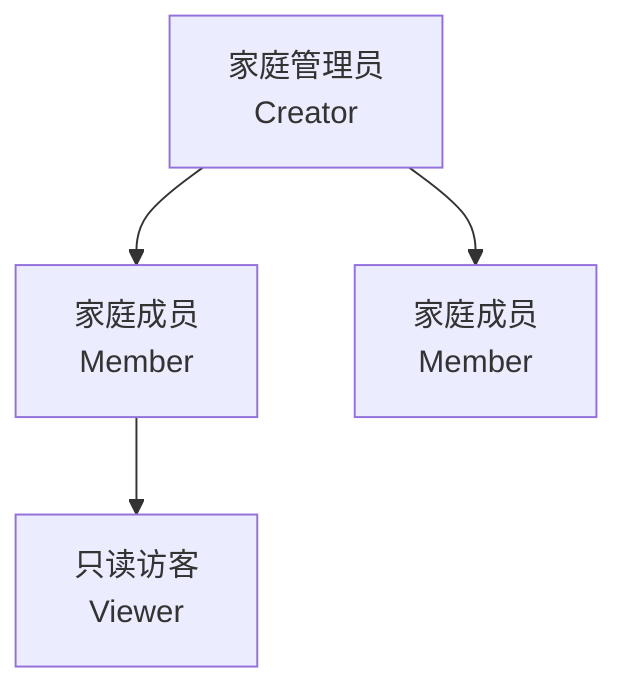

# 家庭管理系统 — 产品需求文档 (PRD)

> **版本**：v1.0  
> **状态**：已定稿  
> **作者**：产品团队  
> **日期**：2026-05-15  
> **技术栈**：Vue 3 + Vite（前端） / NestJS（后端）

---

## 目录

1. [产品概述](#1-产品概述)
2. [市场背景与用户洞察](#2-市场背景与用户洞察)
3. [用户画像](#3-用户画像)
4. [核心功能模块](#4-核心功能模块)
5. [功能需求详述](#5-功能需求详述)
6. [非功能性需求](#6-非功能性需求)
7. [用户流程设计](#7-用户流程设计)
8. [界面交互原则](#8-界面交互原则)
9. [版本规划与优先级](#9-版本规划与优先级)
10. [成功指标](#10-成功指标)

---

## 1. 产品概述

### 1.1 产品定位

"家庭管家" 是一款面向现代家庭的日常生活管理 Web 应用，聚焦于 **家庭财务开支管理** 与 **成员日程协同** 两大核心场景，帮助家庭成员打破信息孤岛，实现透明、高效的协作式家庭运营。

### 1.2 产品愿景

> 让每一个家庭都拥有数字化"大管家"——不再靠脑子记、本子抄、群聊喊，所有家庭事务一站管理、一目了然。

### 1.3 产品目标

| 维度 | 目标 |
|------|------|
| **效率提升** | 家庭财务对账时间从每周 2 小时降至 10 分钟 |
| **信息透明** | 所有成员实时看见家庭开支与待办事项 |
| **减少遗漏** | 账单逾期率、日程遗忘率降低 80% 以上 |
| **决策辅助** | 提供月度消费报告和趋势分析 |

### 1.4 使用场景

- 双职工家庭：夫妻共同管理月开支，同步孩子接送、兴趣班等日程
- 三代同堂：长辈看病提醒、药品库存管理、家庭共同采购
- 合租室友：公共开支分摊、水电缴费提醒、公共区域值日排班

---

## 2. 市场背景与用户洞察

### 2.1 市场现状

- 国内移动支付渗透率超 92%，家庭资金流动频繁但缺乏集中管理
- 78.3% 的家庭"不清楚每月非必要支出占比"（艾瑞咨询）
- 62.5% 的家庭存在"预算制定后难以执行"的问题
- 家庭管理类 App 市场年复合增长率超 21%

### 2.2 竞品分析摘要

| 竞品 | 优势 | 不足 |
|------|------|------|
| Fami (海外) | 全家桶式功能覆盖，UI 精美 | 无中文，付费墙高 |
| TimelyBills | 财务深耕，账单提醒强 | 缺乏日程协同 |
| 随手记/挖财 | 国内用户基数大 | 偏个人记账，家庭协同弱 |
| 飞项/滴答清单 | 任务管理成熟 | 无财务管理模块 |

**机会点**：国内缺少一款同时做好 "家庭财务 + 日程协同" 的轻量级产品。

### 2.3 用户核心痛点

| 痛点 | 描述 | 严重程度 |
|------|------|----------|
| **财务对不上** | 夫妻各记各的，月底总金额对不拢 | ⭐⭐⭐⭐⭐ |
| **账单忘记付** | 水电燃气信用卡还款日没人记得 | ⭐⭐⭐⭐⭐ |
| **钱不知道花哪了** | 月光族但说不清钱去哪了 | ⭐⭐⭐⭐ |
| **日程冲突** | 两人同时安排事情，撞车 | ⭐⭐⭐⭐ |
| **采购混乱** | 重复购买或漏买生活用品 | ⭐⭐⭐ |
| **任务推诿** | 家务分工不清，互相以为对方做了 | ⭐⭐⭐ |

---

## 3. 用户画像

### 3.1 主要角色



### 3.2 角色详述

#### 角色一：家庭管理员（Creator）

- **典型人群**：家庭中承担主要管理责任的人（通常为 30-45 岁职场父母）
- **核心需求**：全局掌握家庭财务与日程，分配任务，设置预算
- **技术熟练度**：中高，熟练使用手机和 Web 应用
- **使用频率**：每日 2-3 次
- **关键场景**：
  - 月初设置家庭月度预算
  - 每天晚上查看当天开支汇总
  - 月末查看消费报表，复盘家庭支出

#### 角色二：家庭成员（Member）

- **典型人群**：配偶、成年子女、同居长辈
- **核心需求**：记录个人开支，查看日程安排，完成分配的任务
- **技术熟练度**：中，会用微信支付宝即可
- **使用频率**：每日 1-2 次
- **关键场景**：
  - 购物后随手记录一笔支出
  - 查看明天需要参加的日程
  - 标记完成自己负责的家务

#### 角色三：只读访客（Viewer）

- **典型人群**：家中老人、未成年子女
- **核心需求**：查看家庭日历，了解家庭安排
- **技术熟练度**：低
- **使用频率**：每周 1-3 次

### 3.3 用户旅程地图（核心场景）

**场景：家庭月度财务管理**

```
月初预算设置 → 日常记账 → 预算预警 → 月结对账 → 消费分析 → 下月规划
    ↓              ↓          ↓          ↓          ↓          ↓
 管理员设定   成员实时录入   超支提醒   月末一键   图表化报表   基于数据
 分类预算     管理员审核     消费降速   汇总核对   趋势分析     调整预算
```

**场景：家庭日程协同**

```
创建日程 → 成员通知 → 临近提醒 → 冲突检测 → 完成/变更
   ↓          ↓          ↓          ↓          ↓
 任意成员   所有成员     推送提醒   时间冲突   状态同步
 添加事件   同步可见     多次提醒   智能预警   全员知晓
```

---

## 4. 核心功能模块

### 4.1 功能全景图

```
家庭管理系统
├── 1. 用户与家庭管理
│   ├── 注册/登录
│   ├── 创建/加入家庭组
│   ├── 角色与权限管理
│   └── 成员邀请与管理
├── 2. 财务管理
│   ├── 收支记录
│   ├── 分类管理
│   ├── 预算管理
│   ├── 账单提醒
│   └── 统计报表
├── 3. 日程管理
│   ├── 家庭共享日历
│   ├── 日程创建与提醒
│   ├── 冲突检测
│   └── 待办清单
├── 4. 物品库存管理
│   ├── 库存物品台账
│   ├── 物品入库/出库/消耗
│   ├── 保质期提醒
│   └── 快速采购清单
├── 5. 仪表盘
│   ├── 今日概览
│   ├── 月度收支摘要
│   ├── 库存预警
│   └── 近期日程
└── 6. 系统设置
    ├── 个人偏好
    ├── 通知设置
    └── 数据导出
```

### 4.2 功能优先级矩阵

| 功能 | 价值 | 复杂度 | 优先级 | 版本 |
|------|------|--------|--------|------|
| 用户注册登录 | 高 | 低 | P0 | V1.0 |
| 创建/加入家庭 | 高 | 中 | P0 | V1.0 |
| 收支记录（CRUD） | 高 | 低 | P0 | V1.0 |
| 支出分类管理 | 高 | 低 | P0 | V1.0 |
| 月度预算设置 | 高 | 中 | P0 | V1.0 |
| 家庭共享日历 | 高 | 中 | P0 | V1.0 |
| 日程提醒 | 高 | 中 | P0 | V1.0 |
| 仪表盘 | 中 | 中 | P0 | V1.0 |
| 统计报表（图表） | 中 | 中 | P1 | V1.0 |
| 待办清单 | 中 | 低 | P1 | V1.0 |
| 物品库存管理 | 中 | 中 | P1 | V1.0 |
| 账单自动提醒 | 中 | 高 | P1 | V1.1 |
| 冲突检测 | 低 | 中 | P2 | V1.1 |
| 数据导出 | 低 | 低 | P2 | V1.1 |
| 多语言支持 | 低 | 中 | P2 | V1.2 |

---

## 5. 功能需求详述

### 5.1 用户与家庭管理

#### 5.1.1 注册与登录

| 项目 | 描述 |
|------|------|
| **需求ID** | U-001 |
| **功能** | 用户注册与登录 |
| **优先级** | P0 |
| **描述** | 用户通过邮箱+密码或手机号注册账号并登录系统 |
| **验收标准** | 1. 支持邮箱注册，验证码验证<br/>2. 支持手机号注册<br/>3. 登录后 JWT Token 有效期 7 天<br/>4. 密码至少 8 位含数字+字母 |
| **交互说明** | 注册/登录合并在同一页面，Tab 切换；支持"忘记密码"流程 |

#### 5.1.2 家庭组管理

| 项目 | 描述 |
|------|------|
| **需求ID** | U-002 |
| **功能** | 创建与加入家庭组 |
| **优先级** | P0 |
| **描述** | 用户可创建一个家庭组（成为管理员），或通过邀请码加入他人的家庭组 |
| **验收标准** | 1. 创建家庭时自动生成唯一邀请码<br/>2. 邀请码有效期 24 小时<br/>3. 成员通过邀请码加入<br/>4. 一个用户可属于多个家庭组 |
| **交互说明** | 首页顶部有家庭切换器，点击可切换当前活动的家庭组 |

#### 5.1.3 角色与权限

| 角色 | 查看收支 | 新增收支 | 删除收支 | 管理成员 | 设置预算 | 创建日程 |
|------|----------|----------|----------|----------|----------|----------|
| Creator | ✅ | ✅ | ✅ | ✅ | ✅ | ✅ |
| Member | ✅ | ✅ | ✅(仅自己) | ❌ | ❌ | ✅ |
| Viewer | ✅ | ❌ | ❌ | ❌ | ❌ | ❌ |

### 5.2 财务管理

#### 5.2.1 收支记录

| 项目 | 描述 |
|------|------|
| **需求ID** | F-001 |
| **功能** | 记录家庭收支 |
| **优先级** | P0 |
| **描述** | 家庭成员可新增、查看、编辑、删除（软删除）收支记录 |
| **数据字段** | 金额、类型（收入/支出）、分类、日期、成员、备注、凭证图片 |
| **验收标准** | 1. 支持快速录入（金额+分类+日期，3 步完成）<br/>2. 支持添加备注和拍照凭证<br/>3. 列表按日期倒序，支持按分类/成员/日期范围筛选<br/>4. 删除为软删除，管理员可恢复 |

#### 5.2.2 分类管理

| 项目 | 描述 |
|------|------|
| **需求ID** | F-002 |
| **功能** | 收支分类管理 |
| **优先级** | P0 |

**系统预置分类**：

| 类型 | 预置分类 |
|------|----------|
| **支出** | 🍜 餐饮、🚗 交通、🏠 住房、⚡ 水电、📚 教育、💊 医疗、🛒 购物、🎮 娱乐、💳 信用卡还款、📱 通讯、🎁 人情、🐱 宠物、💰 其他 |
| **收入** | 💵 工资、🎁 奖金、📈 投资收益、🏠 房租收入、💰 其他 |

**验收标准**：
1. 系统预置 12+ 支出分类、5+ 收入分类，支持彩色图标
2. 管理员可新增/编辑/禁用自定义分类
3. 每笔记录必选分类
4. 分类支持排序，常用置顶

#### 5.2.3 预算管理

| 项目 | 描述 |
|------|------|
| **需求ID** | F-003 |
| **功能** | 月度预算设置与预警 |
| **优先级** | P0 |
| **描述** | 管理员可为家庭设置月度总预算和分类预算 |
| **验收标准** | 1. 支持设置总预算和分类预算<br/>2. 仪表盘实时显示预算使用进度（进度条 + 百分比）<br/>3. 超支 80% 时黄色预警，100% 时红色预警<br/>4. 预算按月循环，每月 1 号自动重置 |

#### 5.2.4 统计报表

| 项目 | 描述 |
|------|------|
| **需求ID** | F-004 |
| **功能** | 收支统计与消费分析 |
| **优先级** | P1 |
| **描述** | 提供可视化图表展示家庭财务概况 |
| **报表类型** | 1. 月度收支总览（收入 vs 支出柱状图）<br/>2. 支出分类占比（饼图/环形图）<br/>3. 月度消费趋势（折线图，6 个月跨度）<br/>4. 成员贡献占比（谁花得多） |
| **验收标准** | 1. 支持本月、上月、近 3 月、近 6 月切换<br/>2. 图表支持交互（点击分类查看明细）<br/>3. 移动端适配（图表响应式） |

### 5.3 日程管理

#### 5.3.1 家庭共享日历

| 项目 | 描述 |
|------|------|
| **需求ID** | S-001 |
| **功能** | 家庭共享日历 |
| **优先级** | P0 |
| **描述** | 所有家庭成员可见的共享日历，按月/周/日视图展示 |
| **验收标准** | 1. 支持月视图（默认）、周视图、日视图三种模式<br/>2. 每条日程按成员颜色区分<br/>3. 点击日期可查看/新增当日日程<br/>4. 支持按成员筛选显示的日程 |

#### 5.3.2 日程创建

| 项目 | 描述 |
|------|------|
| **需求ID** | S-002 |
| **功能** | 创建与编辑日程 |
| **优先级** | P0 |
| **数据字段** | 标题、日期、时间（可选）、重复规则、成员关联、提醒设置、备注 |
| **验收标准** | 1. 支持全天事件和定时事件<br/>2. 支持重复事件（每天/每周/每月/每年/自定义）<br/>3. 支持关联多个家庭成员<br/>4. 可设置提醒时机（事件开始时/15分钟前/1小时前/1天前） |

#### 5.3.3 待办清单

| 项目 | 描述 |
|------|------|
| **需求ID** | S-003 |
| **功能** | 家庭待办事项管理 |
| **优先级** | P1 |
| **描述** | 创建待办事项，指派给家庭成员，追踪完成状态 |
| **数据字段** | 标题、描述、负责人、截止日期、优先级（高/中/低）、状态 |
| **验收标准** | 1. 支持指派给单个或多个成员<br/>2. 完成时标记并记录完成时间<br/>3. 按状态筛选（全部/未完成/已完成）<br/>4. 逾期未完成高亮提醒 |

### 5.4 仪表盘

| 项目 | 描述 |
|------|------|
| **需求ID** | D-001 |
| **功能** | 首页仪表盘 |
| **优先级** | P0 |
| **描述** | 登录后的首页，汇总展示家庭关键信息 |
| **内容模块** | 1. 本月收支概览卡片（收入/支出/结余，环比变化）<br/>2. 预算使用进度条<br/>3. 今日/明日日程列表（3-5 条）<br/>4. 近期待办事项<br/>5. 快捷操作入口（记一笔 / 加日程） |

### 5.5 物品库存管理

#### 5.5.1 库存物品台账

| 项目 | 描述 |
|------|------|
| **需求ID** | I-001 |
| **功能** | 家庭物品库存台账 |
| **优先级** | P1 |
| **描述** | 记录家中物品的名称、数量、存放位置、保质期等信息，支持多维度检索 |
| **数据字段** | 物品名称、分类、数量、单位、存放位置、保质期/过期日、最低库存阈值、备注、图片 |
| **验收标准** | 1. 支持按名称搜索、按分类筛选、按存放位置筛选<br/>2. 支持手动输入和扫码录入（条形码解析）<br/>3. 数量支持增减操作<br/>4. 物品图片可选上传 |
| **物品预置分类** | 🥬 食材生鲜、🧂 调料干货、🧹 清洁用品、💊 药品保健、🧴 个护美妆、🔧 工具杂项、📦 其他 |

#### 5.5.2 入库 / 出库 / 消耗记录

| 项目 | 描述 |
|------|------|
| **需求ID** | I-002 |
| **功能** | 物品入库、出库、消耗的全流程追踪 |
| **优先级** | P1 |
| **描述** | 成员可记录物品的购买入库、日常消耗、过期丢弃等操作，系统自动更新库存数量，并保留操作日志 |
| **验收标准** | 1. 入库：新增物品 or 已有物品补充数量，记录购买日期、价格（可选）<br/>2. 出库/消耗：减少数量，记录操作人和时间<br/>3. 物品数量降到 0 时状态变为"已用完"<br/>4. 每一次进出操作生成一条流水记录 |

#### 5.5.3 保质期 / 低库存预警

| 项目 | 描述 |
|------|------|
| **需求ID** | I-003 |
| **功能** | 保质期预警与低库存提醒 |
| **优先级** | P1 |
| **描述** | 系统自动检测即将过期的物品和低于安全库存的物品，在仪表盘和通知中提醒 |
| **验收标准** | 1. 保质期剩余 ≤ 7 天时黄色预警，已过期红色标记<br/>2. 数量 ≤ 最低阈值时触发"建议补货"提醒<br/>3. 仪表盘库存卡片展示预警摘要（"3 件即将过期 / 2 件需补货"）<br/>4. 到期前 3 天 / 7 天推送通知 |

#### 5.5.4 快速采购清单

| 项目 | 描述 |
|------|------|
| **需求ID** | I-004 |
| **功能** | 一键生成采购清单 |
| **优先级** | P1 |
| **描述** | 基于低库存预警和手动勾选，快速生成家庭采购清单，避免遗漏和重复采购 |
| **验收标准** | 1. 低库存物品一键加入采购清单<br/>2. 支持手动新增采购项<br/>3. 采购完成时一键入库（采购清单物品批量入库）<br/>4. 采购清单支持分享给家庭成员 |

---

## 6. 非功能性需求

### 6.1 性能要求

| 指标 | 要求 |
|------|------|
| 首页加载时间 | ≤ 2 秒（首屏） |
| API 响应时间 | ≤ 200ms（P95） |
| 图表渲染时间 | ≤ 1 秒 |
| 并发用户数 | 支持 1000+ 并发 |

### 6.2 安全要求

| 项目 | 要求 |
|------|------|
| 身份认证 | JWT Token + 过期刷新机制 |
| 密码存储 | bcrypt 加密，不可逆 |
| 数据传输 | 全站 HTTPS |
| API 安全 | 接口鉴权 + 参数校验 + SQL 注入防护 |
| 数据隔离 | 严格的家庭组数据隔离，跨组不可访问 |
| XSS 防护 | 输入输出转义 |

### 6.3 兼容性要求

| 终端 | 要求 |
|------|------|
| 浏览器 | Chrome 90+, Edge 90+, Safari 15+, Firefox 90+ |
| 分辨率 | 1920×1080 / 1440×900 / 移动端 375×667 以上 |
| 响应式 | 支持 Desktop 优先，适配 Tablet |

### 6.4 可用性要求

| 指标 | 要求 |
|------|------|
| 核心任务完成步数 | ≤ 3 步（记录开支） |
| 新用户引导 | 首次登录 3 步引导 |
| 错误处理 | 所有操作有明确的成功/失败反馈 |
| 空状态处理 | 每个列表/图表有空状态引导 |
| 加载状态 | 所有异步操作有骨架屏/Loading 状态 |

---

## 7. 用户流程设计

### 7.1 首次使用流程

```
访问首页 → 注册账号 → 创建家庭组（输入家庭名称）
    → 生成邀请码 → 分享给家人
    → 系统预置分类 → 引导添加第一笔记录
    → 进入仪表盘 → 完成引导
```

### 7.2 成员加入流程

```
收到邀请码 → 注册/登录 → 输入邀请码 → 自动加入家庭组 → 进入仪表盘
```

### 7.3 核心操作流程——记录一笔开支

```
仪表盘点击"记一笔" → 选择收入/支出
    → 输入金额（默认数字键盘）
    → 选择分类（最近使用置顶）
    → 自动填入当天日期（可修改）
    → 可选：备注 + 图片
    → 确认提交 → Toast 提示成功 → 列表自动刷新
```

### 7.4 核心操作流程——创建日程

```
日历视图选择日期 → 点击"+"或选择时间段
    → 输入标题 → 设置时间（可选）
    → 关联成员（可选，默认全部）
    → 设置重复规则（可选）
    → 设置提醒（可选）
    → 确认创建 → 日历实时刷新 → 相关成员收到通知
```

---

## 8. 界面交互原则

### 8.1 设计理念

- **轻量务实**：不做花哨动效，一切以"快"为准
- **信息层级清晰**：重要信息（余额、待办）一眼获取，详情按需展开
- **包容性设计**：大字体选项、高对比度模式、清晰的交互反馈
- **移动优先思维**：Desktop 为主要开发目标，但确保 Tablet 可用

### 8.2 页面结构

```
┌──────────────────────────────────────┐
│  Sidebar          │  Main Content     │
│  ─────            │                   │
│  🏠 仪表盘        │  ┌─────────────┐  │
│  💰 财务管理      │  │  面包屑导航  │  │
│     - 收支记录    │  ├─────────────┤  │
│     - 预算管理    │  │             │  │
│     - 统计报表    │  │  页面内容    │  │
│  📅 日程管理      │  │             │  │
│     - 家庭日历    │  │             │  │
│     - 待办清单    │  │             │  │
│  📦 物品库存      │  │             │  │
│     - 库存台账    │  │             │  │
│     - 采购清单    │  │             │  │
│  👨‍👩‍👧‍👦 家庭成员      │  │             │  │
│  ⚙️ 设置          │  │             │  │
└──────────────────────────────────────┘
```

### 8.3 色彩系统

| 用途 | 色值 | 说明 |
|------|------|------|
| 主色调 | `#4F46E5` (Indigo 600) | 品牌色，按钮、高亮 |
| 成功色 | `#10B981` (Emerald 500) | 收入、完成状态 |
| 警告色 | `#F59E0B` (Amber 500) | 预算预警 |
| 危险色 | `#EF4444` (Red 500) | 超支、删除 |
| 中性色 | `#6B7280` (Gray 500) | 次要文字 |
| 背景色 | `#F9FAFB` (Gray 50) | 页面底色 |
| 卡片色 | `#FFFFFF` | 卡片背景 |

### 8.4 组件规范

- **数字输入**：金额输入使用大字体，自动格式化千分位
- **空状态**：每个列表页提供空状态插图和引导文案
- **骨架屏**：列表/图表加载时使用骨架占位符
- **Toast 消息**：操作反馈使用顶部居中 Toast，3 秒自动消失
- **确认弹窗**：删除操作必须有二次确认
- **无限滚动**：长列表使用分页加载（每页 20 条）

### 8.5 页面线框概要（关键页面）

**仪表盘页面**：
- 顶部：家庭名称 + 切换器 + 当前月份
- 左侧卡片：月度收支总览（大数字：收入 / 支出 / 结余）
- 中间卡片：预算使用进度（分类预算条）
- 右侧卡片：今日日程列表
- 底部：快速操作浮动按钮（记一笔 / 加日程）

**收支记录页面**：
- 顶部：筛选栏（日期范围 / 分类 / 成员）/ 搜索框
- 主体：交易列表（日期分组、金额、分类图标、备注、操作按钮）
- 底部右侧：浮动添加按钮
- 添加弹窗：从右侧滑出的抽屉/模态框

**家庭日历页面**：
- 顶部：月份切换器 + 视图切换（月/周/日）+ 成员筛选
- 主体：日历网格，日程以彩色标签展示
- 点击日期：弹出日程详情卡片

**库存台账页面**：
- 顶部：搜索框 + 分类筛选 + 存放位置筛选
- 主体：物品卡片网格（图标/名称/数量/位置/保质期状态标签）
- 物品卡片颜色标识：绿色(充足) / 黄色(低库存) / 红色(过期)
- 右侧：快捷操作（入库 / 扫码录入）
- 点击物品卡片：进入详情，含出入库流水记录

**采购清单页面**：
- 主体：待采购物品列表（名称/建议数量/来源/勾选状态）
- 顶部：一键添加"缺货物品"
- 底部：完成采购 → 一键入库弹窗
- 支持分享清单链接给家庭成员

---

## 9. 版本规划与优先级

### V1.0（MVP — 4-6 周）

| 优先级 | 模块 | 功能列表 |
|--------|------|----------|
| P0 | 用户系统 | 注册、登录、JWT 认证 |
| P0 | 家庭管理 | 创建家庭、邀请成员、角色权限 |
| P0 | 财务管理 | 收支 CRUD、分类管理、预算设置 |
| P1 | 财务管理 | 统计报表（图表） |
| P0 | 日程管理 | 共享日历、日程 CRUD、提醒 |
| P1 | 日程管理 | 待办清单 |
| P1 | 库存管理 | 库存台账、入库/出库、保质期预警、采购清单 |
| P0 | 仪表盘 | 月度概览、库存预警、快捷操作 |

### V1.1（增强版 — 后续 3 周）

| 优先级 | 功能 |
|--------|------|
| P1 | 账单自动提醒（水电、信用卡还款周期） |
| P1 | 家庭公告板 |
| P1 | 数据导出（Excel/CSV） |
| P2 | 日程冲突检测 |
| P2 | 操作日志审计 |

### V1.2（远期规划）

| 优先级 | 功能 |
|--------|------|
| P2 | 多语言国际化 |
| P2 | 小票 OCR 自动识别 |
| P3 | AI 消费建议 |
| P3 | 移动端 PWA |

---

## 10. 成功指标

### 10.1 北极星指标

> **周活跃家庭数量** (WAH — Weekly Active Households)

### 10.2 关键指标

| 指标类型 | 指标名称 | 目标值（V1.0 后 3 个月） |
|----------|----------|--------------------------|
| 用户规模 | 注册家庭数 | 500+ |
| 活跃度 | DAU / WAU 比例 | ≥ 40% |
| 留存率 | 次月留存率 | ≥ 60% |
| 功能使用 | 月均记录笔数/家庭 | ≥ 50 笔 |
| 功能使用 | 日历月活使用率 | ≥ 70% |
| 体验 | 核心操作完成率 | ≥ 95% |
| 体验 | NPS 净推荐值 | ≥ 40 |

### 10.3 埋点规划（建议）

| 事件 | 属性 |
|------|------|
| `user_signup` | 注册方式（email/phone） |
| `family_create` | 成员数量 |
| `expense_create` | 分类、金额区间 |
| `schedule_create` | 是否重复、是否关联提醒 |
| `dashboard_view` | 停留时间 |
| `report_view` | 报表类型 |

---

> **文档变更记录**

| 版本 | 日期 | 变更内容 | 作者 |
|------|------|----------|------|
| v1.0 | 2026-05-15 | 初版发布 | 产品团队 |
